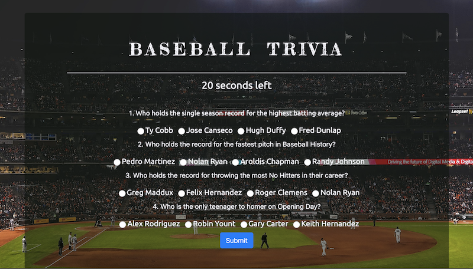

# Baseball Trivia

Test your knowledge of Baseball History in this quick trivia game.

## Game rules

When you click Start, you will be given 4 multiple-choice questions covering some basic history of Baseball. Careful, there's a curveball or two in there. You have 30 seconds to answer all the questions before time runs out. After which, you will be presented with your Score.

## Technology

This project was built with JavaScript, jQuery, Bootstrap, HTML, and CSS. Most all of the HTML content is generated dynamically through JavaScript.